<div align="center">


# Sehat Guftagu (صحت گفتگو)

### AI-Powered Clinical Interview System

[](https://nextjs.org/)
[](https://react.dev/)
[](https://www.typescriptlang.org/)
[](https://tailwindcss.com/)

[](https://www.postgresql.org/)
[](https://www.prisma.io/)
[](https://langchain.com/)

[](https://groq.com/)
[](https://www.pinecone.io/)
[](https://elevenlabs.io/)

</div>

---

## 🌟 Overview

**Sehat Guftagu** is an AI-powered clinical interview platform designed for healthcare landscape. It conducts medical interviews in **Urdu/English**, generates **SOAP reports**, and connects patients with doctors through an intelligent **triage system**.

<div align="center">

|         Feature         | Description                            |
| :---------------------: | :------------------------------------- |
|    🗣️ **Bilingual**     | Full Urdu/English conversation support |
|   🎙️ **Voice & Text**   | Choose your preferred interview mode   |
|  🤖 **Multi-Agent AI**  | 5 specialized LangGraph agents         |
|   📋 **SOAP Reports**   | Automated medical documentation        |
|  👨‍⚕️ **Doctor Portal**   | Review, approve, and prescribe         |
| 🚨 **Emergency Triage** | Automatic red flag detection           |
| 📚 **RAG Integration**  | Medical knowledge retrieval            |

</div>

---

## 🏗️ System Architecture

<div align="center">


_Complete System Architecture Design_

</div>

---

## 🔄 Multi-Agent Orchestration

<div align="center">


_AI Agent Pipeline - From Patient Interview to Doctor Review_

</div>

---

## 🔍 RAG Workflow

<div align="center">


_Medical Knowledge Retrieval System_

</div>

---

## 🛠️ Tech Stack

<div align="center">

### Frontend

|                                                       Technology                                                       | Purpose                          |
| :--------------------------------------------------------------------------------------------------------------------: | :------------------------------- |
|                   | **Next.js 16** - React Framework |
|                     | **React 19** - UI Library        |
|           | **TypeScript 5** - Type Safety   |
|  | **TailwindCSS 4** - Styling      |

### Backend & Database

|                                                  Technology                                                   | Purpose                          |
| :-----------------------------------------------------------------------------------------------------------: | :------------------------------- |
|  | **PostgreSQL** - Database        |
|   | **Prisma** - ORM                 |
|        | **Better Auth** - Authentication |

### AI & Services

|                                               Technology                                                | Purpose                             |
| :-----------------------------------------------------------------------------------------------------: | :---------------------------------- |
|  | **Groq** - LLaMA 3.3 70B LLM        |
|  | **Pinecone** - Vector Database      |
|  | **LangGraph** - Agent Orchestration |
|                                                | **ElevenLabs** - Text-to-Speech     |

</div>

---

## 🚀 Quick Start

### Prerequisites

<div align="center">

|                                             Requirement                                              | Version  |
| :--------------------------------------------------------------------------------------------------: | :------: |
|                 |   18+    |
|  |  Latest  |
|                                             | Required |
|                                     | Required |

</div>

### Installation

```bash
# Clone repository
git clone https://github.com/Inter-AI-Club-Umt/ai-hackathon-techverse2-team-muhammad-muzzammil.git
cd ai-hackathon-techverse2-team-muhammad-muzzammil

# Install dependencies
npm install

# Set up environment variables
cp .env.example .env
# Edit .env with your credentials

# Generate Prisma client
npx prisma generate

# Push database schema
npx prisma db push

# Run development server
npm run dev
```

<div align="center">

🌐 Open [http://localhost:3000](http://localhost:3000) to view the application

</div>

---

## 📚 Documentation

<div align="center">

### 📖 User Guide

[](http://localhost:3000/docs)

### 🔧 Developer Documentation

|                 Document                  | Description                |
| :---------------------------------------: | :------------------------- |
|         📋 [Index](docs/index.md)         | Documentation overview     |
|  🏗️ [Architecture](docs/architecture.md)  | System design & tech stack |
|        🤖 [Agents](docs/agents.md)        | AI agents documentation    |
| 🔌 [API Reference](docs/api-reference.md) | Complete API docs          |
|  🗄️ [Database](docs/database-schema.md)   | Schema & models            |
|   ⚙️ [Environment](docs/environment.md)   | Setup guide                |
|    🎨 [Components](docs/components.md)    | UI components              |

</div>

---

## 🔌 API Endpoints

<div align="center">

| Endpoint               | Method | Description               |
| :--------------------- | :----: | :------------------------ |
| `/api/clinical-chat`   | `POST` | Process interview message |
| `/api/medical-history` | `POST` | Submit medical history    |
| `/api/reports`         | `GET`  | Get user's reports        |
| `/api/reports/[id]`    | `PUT`  | Doctor review action      |
| `/api/voice/stt`       | `POST` | Speech-to-text            |
| `/api/voice/tts`       | `POST` | Text-to-speech            |

</div>

---

## 🔄 Workflow

<div align="center">

### Patient Journey

```mermaid
graph LR
    A[🔐 Signup] --> B[📝 Onboarding]
    B --> C[🎙️ Interview]
    C --> D[📋 Report]
    D --> E[💊 Prescription]
```



### Doctor Journey

```mermaid
graph LR
    A[🔐 Signup] --> B[👨‍⚕️ Profile]
    B --> C[📊 Dashboard]
    C --> D[✅ Review]
    D --> E[📝 Prescribe]
```



</div>

---

## 📁 Project Structure

```
sehat-guftagu/
├── 📂 app/                    # Next.js App Router
│   ├── 📂 (auth)/            # Auth pages
│   ├── 📂 api/               # API endpoints
│   ├── 📂 docs/              # User documentation
│   ├── 📂 doctor/            # Doctor portal
│   └── 📂 patient/           # Patient portal
├── 📂 components/            # React components
├── 📂 docs/                  # Developer documentation
├── 📂 lib/
│   └── 📂 agents/           # AI agent implementations
├── 📂 prisma/               # Database schema
└── 📂 public/               # Static assets
```

---

## ⚙️ Environment Variables

```env
# Database
DATABASE_URL="postgresql://..."

# Authentication
BETTER_AUTH_SECRET="your-secret-key"
BETTER_AUTH_URL="http://localhost:3000"

# AI Services
GROQ_API_KEY="gsk_..."
PINECONE_API_KEY="..."
PINECONE_INDEX_NAME="medical-fast-search"

# Voice Services
ELEVENLABS_API_KEY="..."
UPLIFT_API_KEY="..."
```

> 📖 See [docs/environment.md](docs/environment.md) for complete setup guide

---

## 🧪 Development

```bash
npm run dev      # Start development server
npm run build    # Build for production
npm run start    # Start production server
npm run lint     # Run linter
npx prisma studio  # Open database UI
```
